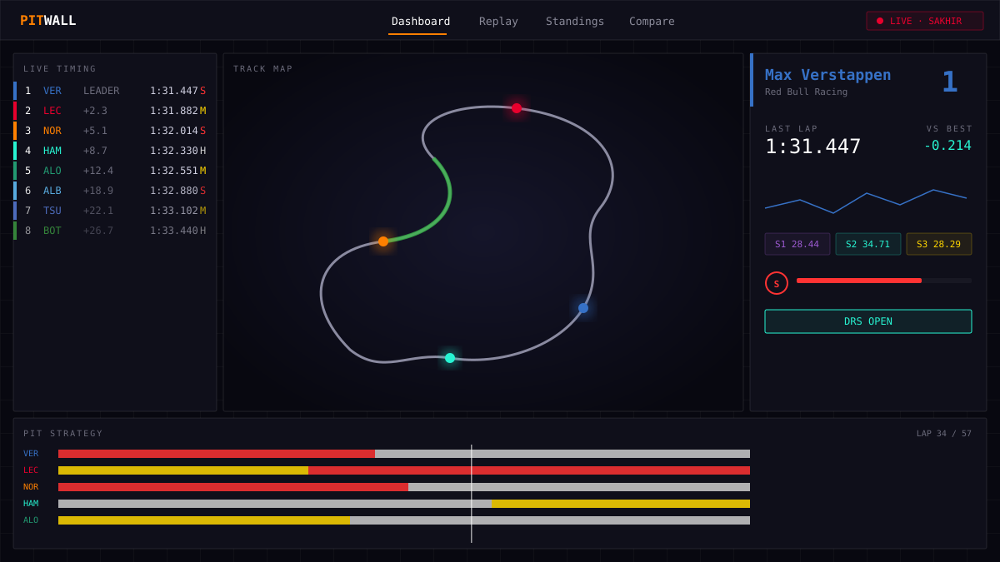

# PitWall

**A full-stack Formula 1 telemetry & analytics platform — live timing, a real-time 3D track map, an interpolated race-replay engine, and head-to-head driver comparison.**



> _Hero screenshot: the live dashboard — timing tower on the left, a 3D track map with glowing team-colored cars and motion trails in the center, a driver telemetry panel on the right, and a full-width pit-strategy timeline along the bottom._

---

## Overview

PitWall is a portfolio piece I built to push myself on the hard parts of a modern data-heavy web app: streaming real-time data to the browser, rendering and animating a 3D scene at 60fps without thrashing React, and designing an interpolation engine that can scrub through an entire race like a video editor. It pulls live and historical data from the [OpenF1](https://openf1.org) API, falls back to [Jolpica](https://github.com/jolpica/jolpica-f1) (the Ergast-compatible successor) for older seasons and championship data, and degrades gracefully to a deterministic simulation engine when no session is live — so the app is always alive, never a blank screen.

Everything is typed end-to-end, every API call is cached with an appropriate TTL, and the entire visual language is a single, deliberate design system: monospaced telemetry numerals, sharp 1px-bordered instrument panels, and team-color-only accents.

## Features

- **Dashboard (live)** — A live timing tower that animates position changes, a 3D track map where each car is a glowing team-colored sphere with a fading motion trail, a driver detail panel (lap deltas, sector chips, tire degradation, throttle/brake, DRS, speed trap), and a pit-strategy timeline for the full grid. Real-time updates arrive over Server-Sent Events.
- **Replay** — Load any historical round and scrub through it. A binary-search interpolation engine resolves the exact, smoothly-interpolated state of every car at any instant, with 1×/5×/20×/50× playback, lap markers and pit-window shading on the scrubber, and keyboard transport (space, ←/→, `[`/`]` for lap jumps).
- **Standings** — Driver and constructor championships with points-delta bars, plus a full season calendar: completed rounds show their podium, upcoming rounds show a live countdown.
- **Compare** — Head-to-head telemetry: a cumulative race-delta trace as the hero chart, overlaid lap-time charts, a four-channel single-lap telemetry overlay (speed / throttle / brake / gear) with a synced cursor, a mini-sector heatmap, and a pit-strategy comparison with automatic undercut detection.

## Architecture

| Concern | Approach |
| --- | --- |
| **Live data** | Server-Sent Events. A Next.js route polls OpenF1 server-side every 500ms (delta queries — only rows newer than the last seen timestamp) and pushes merged position/location frames over a `ReadableStream`, with heartbeats. The client auto-reconnects with backoff and a stall watchdog. The browser never talks to OpenF1 directly. |
| **Dual data source** | OpenF1 is primary (2023+, live + historical). An Ergast-compatible fallback (served by Jolpica — ergast.com was sunset at the end of 2024) covers pre-2023 seasons, standings, and the calendar. Both sources are normalized behind a single typed domain model and validated with Zod at the boundary. |
| **3D rendering** | React Three Fiber. All 20 cars, glows, and motion trails render in three instanced draw calls; transforms are mutated imperatively inside the render loop — never through React state — so a 60fps position stream causes zero React re-renders. The loop pauses when the tab is hidden. |
| **Replay engine** | Timestamped per-driver sample arrays are binary-searched for the bracketing pair at the target time; positions interpolate along the arc-length-parameterized racing line (straight-line lerp would cut corners), with wrap-around handling across the start/finish line. |
| **State** | A single source-agnostic Zustand store ingests frames from SSE, the replay engine, or the simulation. The timing tower subscribes only to the running-order array (changes on overtakes); each row owns a shallow-compared subscription to its own displayed values. |
| **Caching & resilience** | TanStack Query caches historical data aggressively (`staleTime: Infinity` for completed sessions); API routes set explicit TTLs. Upstream fetches get an 8s timeout, 3 retries with exponential backoff, and `Retry-After` handling. Every major surface sits in its own error boundary. |
| **Simulation fallback** | When OpenF1 returns nothing, a deterministic engine generates a believable race (2024 grid, tire-degradation curves, pit strategy). It is always clearly labelled **SIMULATION MODE** and never presented as real data. |

### Project layout

```
src/
  app/            App Router pages (dashboard, replay, standings, compare) + API routes
  components/     nav · dashboard · track (R3F) · replay · standings · compare · ui
  hooks/          useLiveRace (SSE + sim), useReplay (playback engine), data queries
  store/          raceStore — Zustand, source-agnostic
  lib/            openf1 + ergast clients, zod schemas, hardened fetcher,
                  replayEngine, simEngine, tireDeg, teamColors,
                  trackPaths/ (19 arc-length-parameterized circuits)
scripts/          verify-engines.ts — headless test harness for the logic layer
```

A deeper walkthrough (data-flow diagram, how the sim fallback engages, replay
timing internals) lives in [ARCHITECTURE.md](ARCHITECTURE.md).

## Tech stack


- **Framework:** Next.js 14 (App Router), TypeScript
- **3D / viz:** React Three Fiber, @react-three/drei, Three.js
- **UI / animation:** Tailwind CSS, Framer Motion, Recharts, lucide-react
- **State / data:** Zustand, TanStack Query, axios, date-fns
- **Backend:** Next.js API routes (Vercel-ready)

## Local development

```bash
# 1. Install dependencies
npm install

# 2. Configure environment (defaults work out of the box)
cp .env.example .env.local

# 3. Run the dev server
npm run dev
```

Then open [http://localhost:3000](http://localhost:3000).

```bash
npm run build      # production build
npm run typecheck  # strict TypeScript check
npm run lint       # Next.js lint
npx tsx scripts/verify-engines.ts   # headless engine/logic test harness
```

All variables have working defaults — the app boots with no `.env.local` at all.

### Environment variables

```
OPENF1_BASE_URL=https://api.openf1.org/v1
ERGAST_BASE_URL=https://api.jolpi.ca/ergast/f1
NEXT_PUBLIC_APP_NAME=PitWall
```

## Screenshots

> Captures to drop into `docs/` (the hero above is a vector mock until then):
> `docs/dashboard.png` — live dashboard with timing tower, 3D map, and strategy strip ·
> `docs/replay.png` — replay scrubber mid-race · `docs/compare-delta.png` — race-delta trace ·
> `docs/standings.png` — championship tables and calendar.

## Data sources

- **[OpenF1](https://openf1.org)** — primary source for live and historical timing, position, car telemetry, pit, and stint data.
- **[Jolpica](https://github.com/jolpica/jolpica-f1)** — the community successor to the Ergast API (ergast.com was sunset at the end of 2024), used as a cold fallback for pre-2023 seasons, championship standings, and the race calendar. The client speaks the Ergast interface, so the base URL is swappable via `ERGAST_BASE_URL`.

Track outlines are authored as compact normalized anchor points, expanded with a Catmull-Rom spline, and re-spaced to uniform arc length at load time, covering 19 circuits. They are stylized representations for the live map — not survey-accurate geometry.

---

_Built by Kartheek M. F1 data © their respective providers; this project is an independent, non-commercial portfolio piece and is not affiliated with Formula 1._
